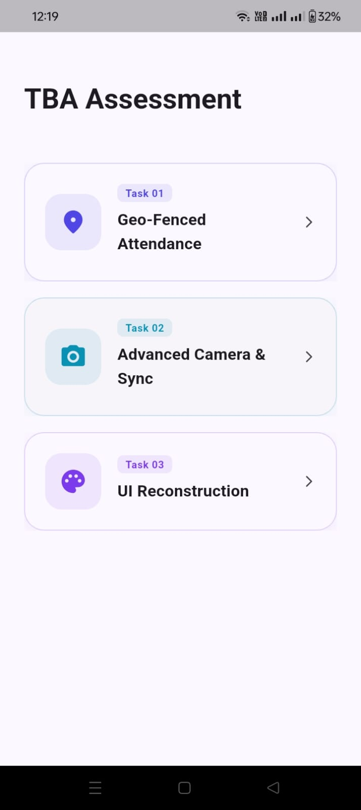
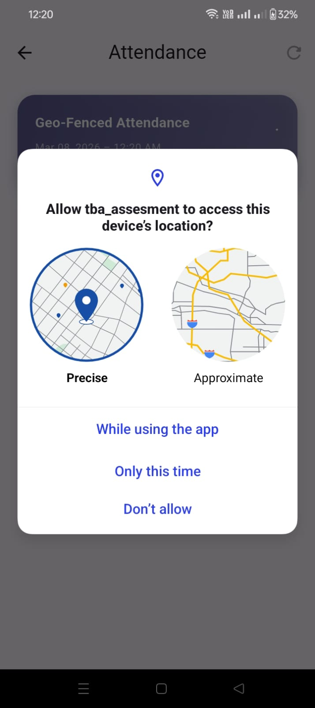
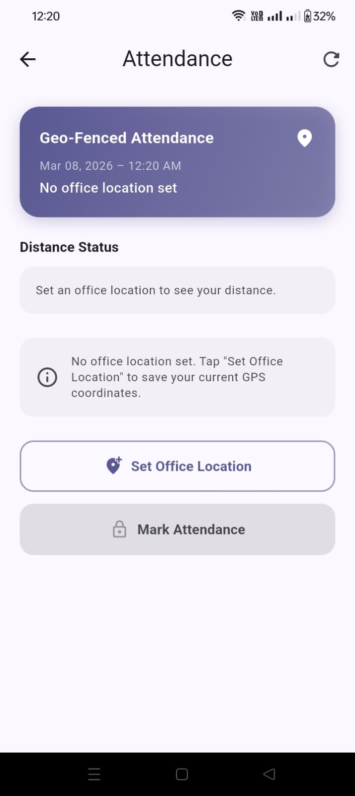
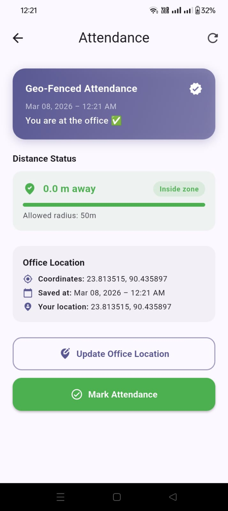
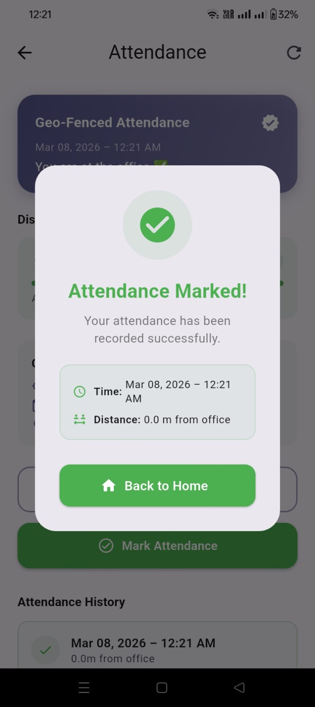
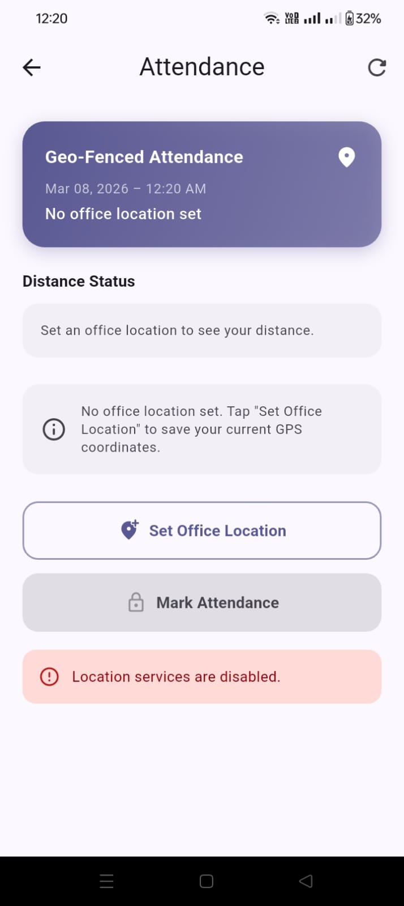

# TBA Assessment — Flutter Technical Tasks

A Flutter application demonstrating three advanced engineering challenges:
**Geo-Fenced Attendance**, **Advanced Camera & Sync Engine**, and **UI Reconstruction**.
Built end-to-end with Clean Architecture, BLoC state management, and resilient background processing.

---

## 📋 Table of Contents

- [Technical Stack](#technical-stack)
- [Project Structure & Architecture](#project-structure--architecture)
- [Task 1 — Geo-Fenced Attendance](#task-1--geo-fenced-attendance)
- [Task 2 — Advanced Camera & Sync Engine](#task-2--advanced-camera--sync-engine)
- [Task 3 — UI Reconstruction](#task-3--ui-reconstruction)
- [Generative AI Usage](#generative-ai-usage)
- [How to Run](#how-to-run)
- [Screenshots](#screenshots)

---

## 🛠 Technical Stack

| Category | Package / Tool |
|---|---|
| Framework | Flutter 3.x |
| State Management | `flutter_bloc` |
| Dependency Injection | `get_it` |
| Functional Error Handling | `dartz` (Either) |
| Local Storage | `shared_preferences`, `hive_flutter` |
| Location | `geolocator` |
| Camera | `camera` |
| Background Tasks | `workmanager` |
| Connectivity | `connectivity_plus` |
| Unique IDs | `uuid` |

---

## 🏗 Project Structure & Architecture

All three features follow **Clean Architecture** — each feature is self-contained across three layers with a strict dependency rule: outer layers depend on inner ones, never the reverse.

```
lib/
├── main.dart
├── home_screen.dart
├── core/
│   ├── constants/
│   ├── di/                  ← GetIt injection container
│   ├── error/               ← Failures & Exceptions
│   ├── extensions/          ← Either helpers
│   ├── usecases/            ← Base UseCase<T, P>
│   └── utils/
└── features/
    ├── attendance/
    │   ├── domain/          ← Entities, Repository interfaces, Use Cases
    │   ├── data/            ← Repository impls, Models, Data Sources
    │   └── presentation/    ← AttendanceBloc, Screen, Widgets
    ├── camera/
    │   ├── domain/
    │   ├── data/
    │   │   └── background/  ← WorkManager background isolate
    │   └── presentation/    ← CameraBloc, SyncBloc, Screen, Widgets
    └── ui_reconstraction/
        └── presentation/    ← Animated widgets, UiReconstructionScreen
```

**Layer responsibilities:**

- **Domain** — pure Dart only. Entities, abstract repository contracts, typed use cases returning `Either<Failure, T>`. Zero Flutter imports.
- **Data** — implements repository contracts. Maps exceptions to `Failure` types. Serialises models to/from Hive and SharedPreferences.
- **Presentation** — BLoC consumes use cases and emits immutable states. Widgets are purely reactive; zero business logic.

**Main BLoC classes:**

| BLoC | Responsibility |
|---|---|
| `AttendanceBloc` | GPS fetch, geofence check, office location save/load, mark attendance |
| `CameraBloc` | Camera init, image capture, pinch zoom with debounce, tap-to-focus |
| `SyncBloc` | Upload queue management, real internet check, auto retry on reconnect |

---

## Task 1 — 📍 Geo-Fenced Attendance

**What it does:** Employees can only mark attendance when physically within 50 metres of the office. The office location is set once from the device's current GPS position and persisted locally.

**Key implementation details:**

- `FetchCurrentLocation` use case wraps `geolocator` with a 15-second timeout and maps permission/service exceptions to typed `Failure` objects
- `GeofenceCalculatorService` uses the Haversine formula to compute distance between two coordinates
- `CheckIfUserIsWithinAllowedRadius` compares the live distance against the 50 m constant from `AppConstants`
- Office location is stored in `SharedPreferences` as JSON; attendance records are stored in Hive
- `AttendanceBloc` emits distinct states: `AttendanceInitial`, `AttendanceFetchingLocation`, `AttendanceLocationFetched`, `AttendanceMarked`, `AttendanceError` — the UI reacts to each without any logic

**Flow:**

```
Set Office Location → saves GPS coords to SharedPreferences
     ↓
Mark Attendance → fetch live GPS → calculate distance → check 50m radius
     ↓                                                        ↓
AttendanceMarked (success dialog)              AttendanceError (too far away)
```

---

## Task 2 — 📷 Advanced Camera & Sync Engine

**What it does:** A full custom camera screen with pinch-to-zoom, tap-to-focus, batch image capture, and a resilient background upload engine that retries automatically when connectivity is restored — even after the app is killed.

### Custom Camera UI

- **Pinch-to-zoom** — `ScaleGestureDetector` tracks `scaleStart` base zoom and dispatches `SetZoomLevelEvent` only when delta exceeds 0.01 to avoid jitter
- **Zoom debounce** — UI state updates instantly on every gesture event; actual `CameraController.setZoomLevel()` call is debounced by 50 ms via `ApplyZoomToHardwareEvent` to prevent flooding the camera API
- **Zoom slider** — `ZoomSliderWidget` with custom `SliderTheme`; clamped to `[minZoom, maxZoom]` from device capabilities
- **Preset buttons** — `ZoomPresetButtonsWidget` builds dynamically from `CameraConfiguration.availableZoomPresets` (only adds a preset if the device camera supports it)
- **Tap-to-focus** — normalises tap offset to `[0.0, 1.0]` range, calls `CameraController.setFocusPoint()`, shows `FocusIndicatorWidget` (animated yellow square that scales from 1.6× to 1.0× then auto-hides after 2 seconds)

### Batch Management

- Every capture generates a unique `batchId` via `uuid.v4()` so each image appears as its own entry in the pending list
- `PendingUploadsList` shows batch number, image count, creation timestamp, and a status chip (`Pending` / `Uploading…` / `Uploaded` / `Failed ×N`)
- The slide-up panel is toggled from the top status bar pill which also shows connectivity dot and queue count

### Resilient Sync Engine

**Foreground path (`SyncBloc`):**
- `StartConnectivityMonitorEvent` registers both a `connectivity_plus` stream listener and a 4-second polling timer as a fallback
- Both paths call `InternetAddress.lookup('google.com')` to verify real internet (not just adapter presence — catches captive portals and no-data plans)
- When offline → online transition is detected, `TriggerUploadEvent` fires automatically — no user action needed
- On app resume (`LoadPendingUploadsEvent`), any batch stuck in `uploading` status (killed mid-upload) is reset to `pending` before the list is returned, then upload is triggered immediately if internet is available

**Background path (`BackgroundSyncScheduler` / WorkManager):**
- `backgroundWorkerEntryPoint()` is a **top-level function** with `@pragma('vm:entry-point')` — required for AOT/release builds so the Dart compiler does not tree-shake it
- Called in `main()` **before** `runApp()` so the entry point is registered before any UI exists
- Periodic task fires every 15 minutes via `WorkManager.registerPeriodicTask` with `ExistingWorkPolicy.keep`
- Background isolate re-initialises Hive independently (isolates have no shared memory), runs the upload use case, then closes the Hive box to release file locks for the main app
- `triggerImmediateUploadNow()` registers a one-off task with a timestamp-suffix unique tag so Android does not deduplicate it

**Why uploads survive app kill:**

```
App killed mid-upload
       ↓
Batch left as uploadStatus = "uploading" in Hive
       ↓
App reopened → retrievePendingUploadQueue() resets "uploading" → "pending"
       ↓
_handleLoadPendingUploads detects internet already on → TriggerUploadEvent fires
       ↓
Upload retried automatically, no user action needed
```

---

## Task 3 — 🎨 UI Reconstruction

**What it does:** A pixel-accurate recreation of a provided design with smooth animations, micro-interactions, and a responsive layout that adapts across screen sizes.

**Key implementation details:**

- `AnimatedStatCard` — uses `TweenAnimationBuilder` to count up numeric values on mount, with a staggered delay per card
- `AnimatedProgressRing` — custom `CustomPainter` draws an arc that animates from 0 to the target percentage using `AnimationController` with `CurvedAnimation(curve: Curves.easeOutCubic)`
- `AnimatedToggleChip` — `AnimatedContainer` swaps background colour and border on tap with 200 ms ease
- `ActivityTimelineItem` — timeline connector line drawn with a `Container` of fixed width; leading icon animates in with a `FadeTransition` + `SlideTransition`
- `FeatureNavigationTile` — `InkWell` with custom splash colour matching the tile accent; trailing arrow rotates 90° on hover using `TweenAnimationBuilder`
- `ShowcaseTheme` — centralised token system (colours, text styles, border radii, shadows) so every widget pulls from a single source of truth
- All animations are driven by a single `TickerProviderStateMixin` in the parent screen to keep controllers coordinated and disposed correctly

---

## 🤖 Generative AI Usage

Claude (Anthropic) was used to accelerate development. All generated output was manually reviewed, tested on device, and integrated intentionally.

---

## 🚀 How to Run

```bash
git clone https://github.com/your-username/tba-assessment.git
cd tba-assessment
flutter pub get
flutter run
```

**Requirements:**
- Flutter 3.x SDK
- Physical Android device recommended (GPS and camera require real hardware)
- Location and camera permissions must be granted on first launch

**Release build** (required to properly test WorkManager background tasks):

```bash
flutter build apk --release
adb install build/app/outputs/flutter-apk/app-release.apk
```

**Useful debug commands:**

```bash
# Watch all sync-related logs live
adb logcat | grep -E "\[BGWorker\]|\[SyncBloc\]|\[SyncRepo\]|\[HiveDS\]"

# Watch attendance logs
adb logcat | grep -E "\[AttendanceBloc\]|\[GeofenceService\]"
```

---

## 📸 Screenshots

| Home | Task 1 — Attendance |
|---|---|
|  |  |

| Task 2 — Camera | Task 2 — Pending Uploads |
|---|---|
|  |  |

| Task 3 — UI Showcase | Task 3 — Detail |
|---|---|
|  |  |
> Replace the placeholders above with screenshots after running on a device.
> Recommended tool: `adb shell screencap -p /sdcard/screen.png && adb pull /sdcard/screen.png`
